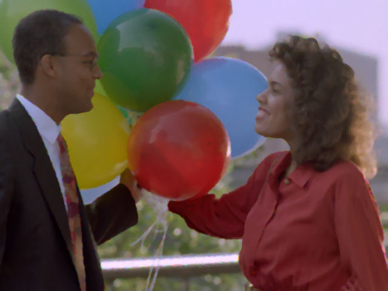
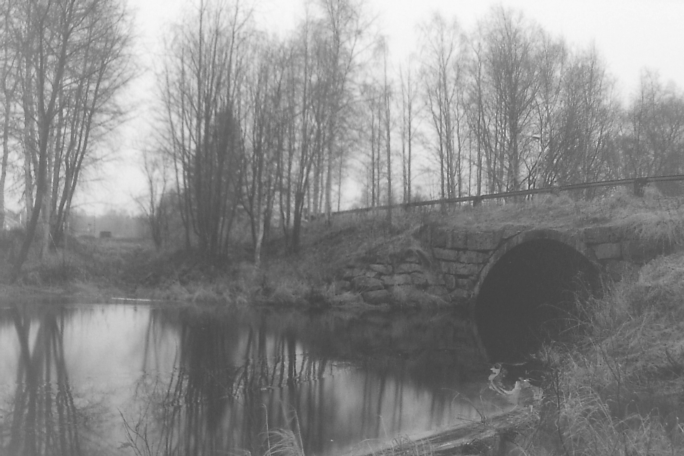

# Image Processing Toolbox 🧰

A powerful command-line image processing suite using PIL, featuring all the standard image editing tools, along with my own __experimental__ and  __psychedelic__ (✨) visual transformations.


The text-based interface is responsive and user-friendly, featuring a REPL-style loop for navigating menus and applying effects. Reusable input prompts make for clean, maintainable code under the hood.

## Installation

1. Clone the repo:

	```bash
	git clone https://github.com/jray-8/image-toolbox.git
	```

2. Install Pillow (an updated fork of PIL):

	```bash
	pip install pillow
	```

3. Run the program:

	```bash
	python image_toolbox.py <input-image> [output-image]
	```

	- If no output is specified, the input image will be modified in-place
	- You may specify the full path to your images

	Ex.

	```bash
	python image_toolbox.py images/balloons.png images/balloons-clear.png
	```


## Features

- REPL-style interactive menu


__Controls__

- `w` – Instant preview (opens image viewer)

- `s` – Save images

- `a | d` – Turn pages

- `pX` – Jump to page `X`

- `q` – Quit

__Additional__

- All changes are non-destructive until saved.

- Pressing `Enter` with no response will use default values

- `Cross 1` indicates `horizontal`, then `vertical`

- `Cross 2` indicates `vertical`, then `horizontal`

- Use `ctrl + c` to abort current editing session


### Effects

__🧱 Page 1: Basics__

- Crop

- Flip

- Rotate

- Scale – resize with an interpolation type: __nearest neighbor__, __bilinear__, or __box sampling__

- Pad

<br>

__🎨 Page 2: Color / Contrast__

- Hue Shift – rotate the hue of all colors by some degree

- Resaturation

- Transformations – apply brightness, contrast, gamma correction

- Show Histogram – visualize the distribution of pixel intensities

- Histogram Equalization – contrast enhancement by uniformly distributing intensities

- Monochrome Conversion – grayscale, redscale, custom colors

- Pseudo Color 
	- False-color mapping for grayscale images using intensity heatmap or random colors

- _Color Split_ ✨
	- Choose a shape (like Y), and rip selected color channels apart from each other
 
<br>

__🌀 Page 3: Filters & Pixel Sorting__

- Convolution Matrices
	- Create your own custom-sized kernel (for edge-detection, blur, sharpen, etc.)

		> Hint: use the non-linear median filter (5x5) to reveal the balloons: `images/balloons.png`

- Non-Linear Filters
	- A kernel that applies the `min`, `max`, or `median` function to neighborhoods of pixels

- Line Sort
	- Reorder lines (or chunks) of the image based on brightness, randomness, or apply a circular shift

- _Glitch Sort_ ✨
	- Experimental glitch-art effect with lots of parameters
	- Choose `rows`, `columns`, or `chunks` to rearrange
	- Adjust glitch `frequency`, `coverage`, and `direction`
	- Apply a sorting function: `brightness`, `random`, `rotate`, `wave shift`
	- Choose where on the image the glitch starts: `top`, `bottom`, `middle`

- _Ghost Split_ ✨
	- Trippy effect where every second line of pixels is shifted in some direction, splitting the image in two and creating the illusion of a superimposed ghost image  (as our eyes fail to distinguish the tiny slits where the lines were moved)
	- Additional parameters allow you to blend the adjacent line pairs after shifting
	- You may control the direction of the split, the number of splits (the image may be subdivided for multiple ghost to form), and whether the shift is circular

<br>

__🌊 Page 4: Warp Effects__

- Wave Warp
	- Apply a `square`, `triangular`, `sin` or `sawtooth` wave distortion across the image
	- Choose wave `period`, `amplitude` and `direction`

- _Mirror_ ✨
	- Choose a number of mirrors—lines dividing the image vertically or horizontally—and copy one side of the mirror to the other in reverse

<br>

__🎭  Page 5: Blending & Overlays__

- Blend Lines – blend multiple rows or columns together with one of many blending modes

- Pixelate

- Overlay
	- Superimpose a secondary image onto the first one
	- You may specify a blend mode in addition to the opacity of the overlay

<br>

## Examples

Behold, the creative __power__ of the toolbox!

Here are a few transformations made with the sample photos found in the `images/` folder.

| Before |  After | Description |
|:------:|:------:|:-----------:|
|  |  | Denoising Balloons (Median Filter) |
|  |  | Histogram Equalization (For Contrast) & Sharpening Kernel: <br>`0 -1 0`<br>`-1 5 -1`<br>`0 -1 0` |
|  |  | Analyzing Pixel Intensity with Pseudo-Color Heatmap |
|  |  | Horizontal Flip & Resaturation |
|  |  | Bottom Mirror & Horizontal Sine Wave Warp |
|  |  | Rotate 45° CCW with Reflected-Indexing & Crop Bottom |
|  |  | Y-Shaped RGB Color Split |
|  |  | Horizontal Glitch Sort with Circular Shifting |
|  |  | Blank Ghost Split with Average Blending |

<br>

## What Will _You_ Create Using The 8 Original Photos?

